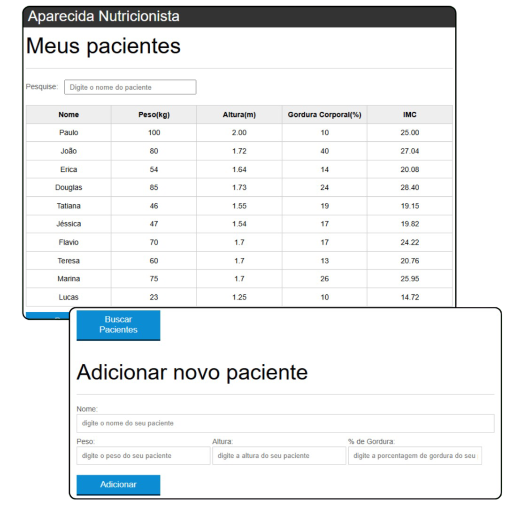

<h1 align="center"> Nutricion </h1>

Site de gerenciamento de pacientes.

  <a href="#-tecnologias">Tecnologias</a>&nbsp;&nbsp;&nbsp;|&nbsp;&nbsp;&nbsp;
  <a href="#-projeto">Projeto</a>&nbsp;&nbsp;&nbsp;

 

  

## 🚀 Tecnologias

Esse projeto foi desenvolvido com as seguintes tecnologias:

- HTML e CSS
- JavaScript
- Ajax
- Git e Github

## 💻 Projeto

Projeto de Site de Nutrição com as seguintes funções: 
- Leitura de informações;
- Adição de pacientes com seus dados;
- Exclusão de pacientes;
- Sistema de filtragem para busca de pacientes na tabela;
- Uso das tecnicas Ajax para busca de e adição de novos pacientes em uma API utilizando o GET e o Send.